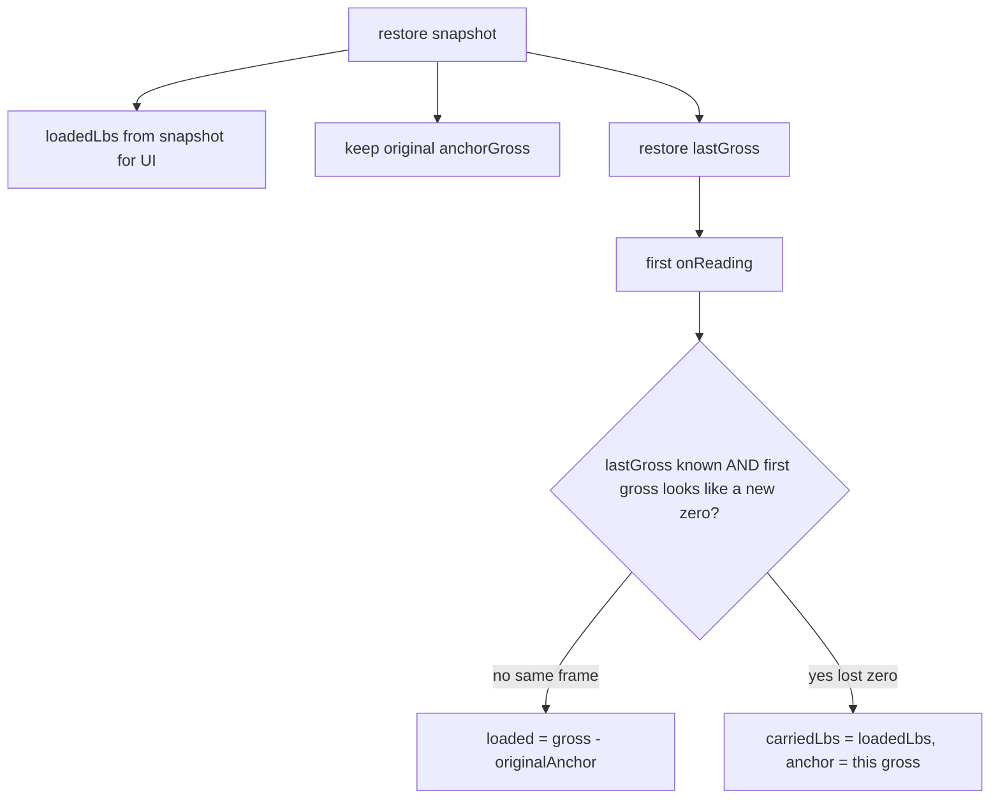

# Restore without double-count, persist lastGross

Fix restore double-counting by keeping the original scale anchor, persist
`lastGross`, and re-anchor only when the first post-restore reading looks
like a lost scale zero.

This is the working plan for kata task 2 plus the scale-frame cases we
agreed on. It is not implemented yet.

## Status

| Step | What |
| --- | --- |
| Snapshot `lastGross` | Add `lastGross` to `SessionSnapshot`; `snapshot()` and `restore()` copy it; do not set `carriedLbs` from `loadedLbs` |
| Frame check | One-shot post-restore `onReading` check: same-frame uses original anchor; near-zero vs `lastGross` re-anchors with `carriedLbs` |
| Tests | Keep task 2 green; add `lastGross`, missed-dump, lost-zero, and manual-advance-after-restore tests |
| Docs | Update persistence, weight-accounting, and spec-vs-implementation for the two restore paths |

## Behavior

Default restore treats the scale as still in the same zero: keep the original
ingredient anchor and credit `gross − anchor`. Persist `lastGross` so a
restore can (1) re-anchor the next line on manual Next with no new tick, and
(2) detect a **lost scale zero** (app and scale both down) and re-anchor once.

**Same frame** (app died, scale kept running): do **not** copy
`snapshot.loadedLbs` into `carriedLbs`. After restore, `1300` then `1500`
with original anchor `800` is loaded `700`. A missed dump to `1600` becomes
loaded `800`.

**Lost zero** (first tick after restore looks like a reset, e.g. mixer was
~1300 and comes back near 0): set `carriedLbs = loadedLbs`, clear
`anchorGross`, then the existing first-reading path re-anchors and keeps the
persisted 500. Upward jumps are **not** a reset (those are missed dumps).

Heuristic: on the **first** post-restore reading only, before overwriting
`lastGross`, treat as reset if `lastGross` is a real mixer weight and
`gross <= settleLbs` (near-empty vs last known). A true empty-out during
downtime will also re-anchor; that limitation goes in notes/docs.

`carriedLbs` stays: it is 0 for same-frame restore, and the persisted load
only on the lost-zero path.

## Code

[`src/types.ts`](../../src/types.ts) — add `lastGross: number | null` to
`SessionSnapshot`.

[`src/session.ts`](../../src/session.ts):

- `snapshot()` includes `lastGross`.
- `restore()` copies `index`, `anchorGross`, `loadedLbs`, `complete`,
  `lastGross`. **Stop** `session.carriedLbs = snapshot.loadedLbs`. Set a
  one-shot `pendingScaleFrameCheck` when `lastGross != null` and not complete.
- `onReading`: if pending check, compare `reading.gross` to current
  `lastGross`, maybe re-anchor as above, then clear the flag; then assign
  `lastGross = reading.gross` as today.

## Tests

In [`test/session.test.ts`](../../test/session.test.ts) kill-and-restore:

- Existing task 2 test should pass with no assertion change (`700` / index 0).
- Snapshot/restore round-trip includes `lastGross` (1300 after those readings).
- Same-frame missed dump: restore, then `1600` → loaded `800`, still index 0.
- Lost zero: restore, then `0` then `200` → loaded `700` (500 carried + 200),
  still index 0.
- Manual Next after restore with no reading uses restored `lastGross` as the
  next ingredient’s anchor (Hay `SET_TARGET`, not a null-anchor first-reading).

## Docs to update when implementing

- [`docs/features/persistence.md`](../features/persistence.md)
- [`docs/features/weight-accounting.md`](../features/weight-accounting.md)
- [`docs/spec-vs-implementation.md`](../spec-vs-implementation.md)

Task 2 done, `lastGross` in the snapshot, same-frame vs lost-zero,
`carriedLbs` only for lost-zero. Do not implement task 3 in this pass.
